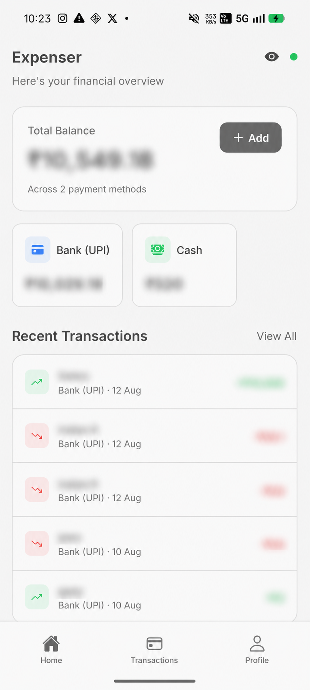
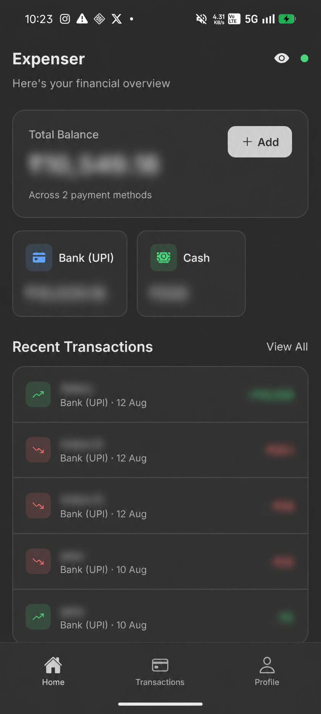
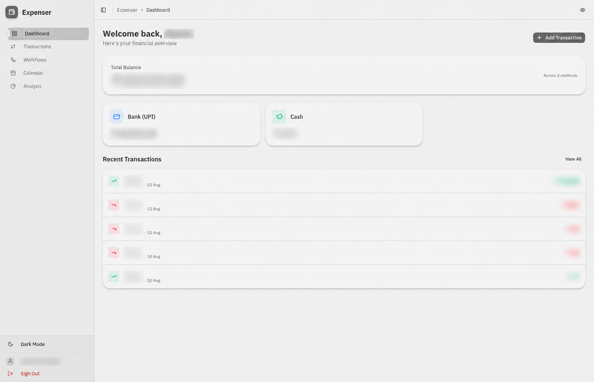
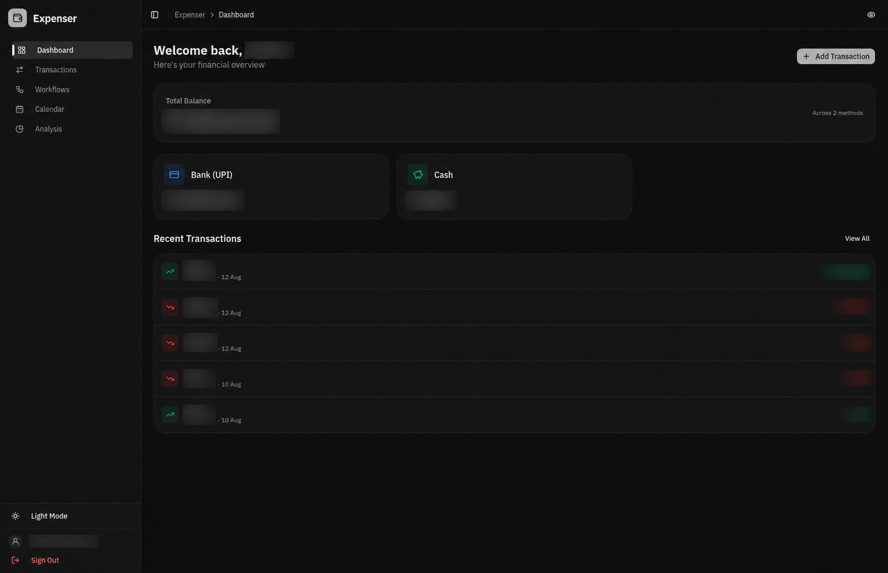

# Expenser

Personal transaction tracking on Android and the web.

Expenser records income and expenses against Bank, Cash, and Splitwise balances. The Android app can turn supported bank SMS notifications into transactions, keeps edits usable offline, and syncs queued changes when connectivity returns.

## Screenshots

### Mobile

<table>
  <tr>
    <th>Light</th>
    <th>Dark</th>
  </tr>
  <tr>
    <td></td>
    <td></td>
  </tr>
</table>

### Web

<table>
  <tr>
    <th>Light</th>
    <th>Dark</th>
  </tr>
  <tr>
    <td></td>
    <td></td>
  </tr>
</table>

Personal names, balances, transaction descriptions, and transaction amounts are blurred in every screenshot. No account identifiers or credentials are shown.

## Run locally

```bash
cd next
npm install
npm run dev
```

```bash
cd expo
npm install
npm start
```

The web app is available at [expenser-rdp.vercel.app](https://expenser-rdp.vercel.app).
